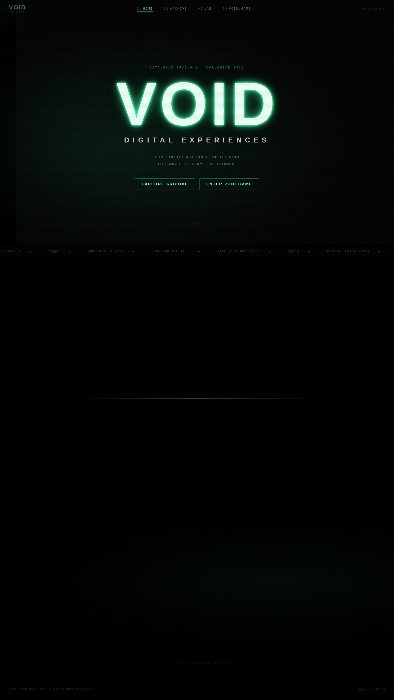
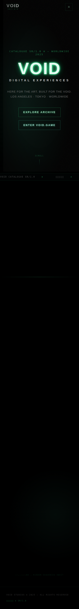
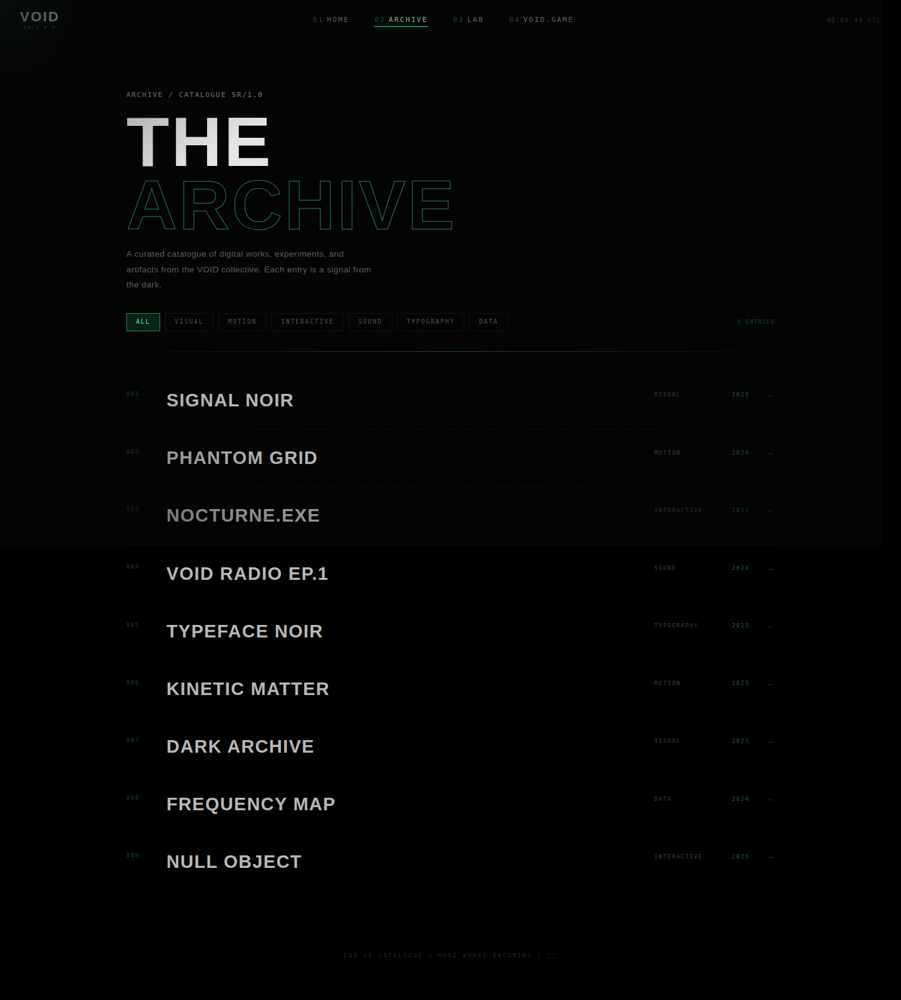
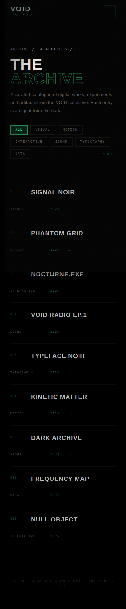
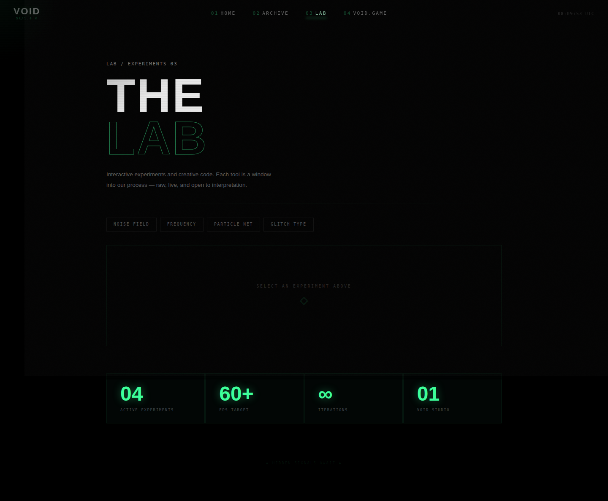
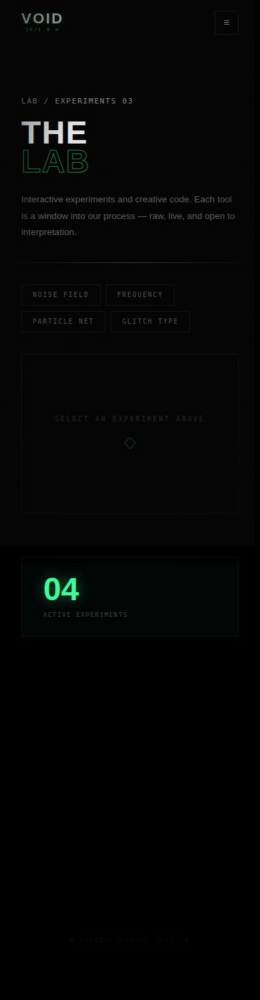
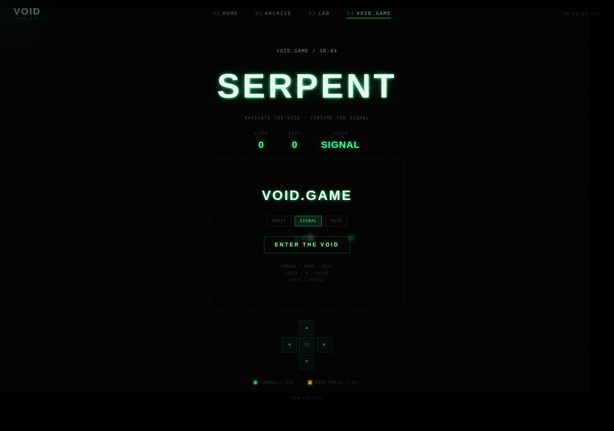
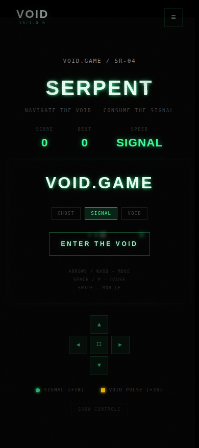

# Void-Green

🌐 **Live Site:** [https://anacondy.github.io/Void-Green/](https://anacondy.github.io/Void-Green/)

---

**VOID — SR/1.0** is a dark, atmospheric, and interactive digital experience built with React, TypeScript, Vite, and Framer Motion. It features smooth 60 FPS animations, mobile-optimized layouts, and a curated catalogue of digital works, experiments, and an interactive game.

---

## Screenshots

### Home — Desktop


### Home — Mobile


### Archive — Desktop


### Archive — Mobile


### Lab — Desktop


### Lab — Mobile


### Game — Desktop


### Game — Mobile


---

## Features

- **Home** — Immersive hero with glitch effects, parallax mouse tracking, Konami code easter egg, and scrolling credits ticker
- **Archive** — Filterable catalogue of digital works with animated expand/collapse entries
- **Lab** — Interactive experiments: noise field, frequency visualizer, particle net, and glitch text generator
- **Void.Game** — Snake game with particle effects, power-ups, and multiple speed levels
- **Secret** — Hidden page reachable via the Konami code `↑↑↓↓←→←→BA`

## Design System

| Token | Value |
|-------|-------|
| Primary font | Barlow Condensed |
| Mono font | Space Mono |
| Body font | Space Grotesk |
| Accent color | `#3dff9a` (Glow Green) |
| Background | `#000000` (Pure Black) |

## Tech Stack

- **React 19** + **TypeScript**
- **Vite 7** — build tool with code-splitting
- **Tailwind CSS v4** — utility-first styling
- **Framer Motion** — 60 FPS GPU-accelerated animations
- **React Router v7** — hash-based client-side routing for GitHub Pages

## Performance

- Target: **60 FPS** on all devices
- GPU-accelerated layers via `will-change: transform` and `transform: translateZ(0)`
- Passive event listeners for scroll/mouse/resize
- Code-split vendor, router, and motion bundles
- Reduced motion support (`prefers-reduced-motion`)
- Safe-area inset support for notched devices

## Mobile Optimizations

- `viewport-fit=cover` for full-bleed displays
- Safe area insets for iPhone notch / Dynamic Island
- Touch-friendly button sizes (min 44px tap targets)
- Hover states disabled on touch devices to prevent stuck states
- Cursor glow hidden on touch devices
- Responsive typography via `clamp()`

## Development

```bash
npm install
npm run dev       # Development server
npm run build     # Production build (outputs to dist/)
npm run preview   # Preview production build
```

## Deployment

The site automatically deploys to **GitHub Pages** via the included GitHub Actions workflow (`.github/workflows/deploy.yml`) on every push to `main`.
